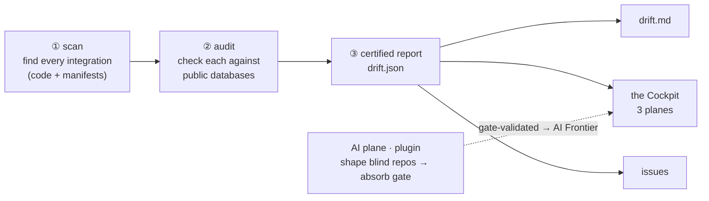
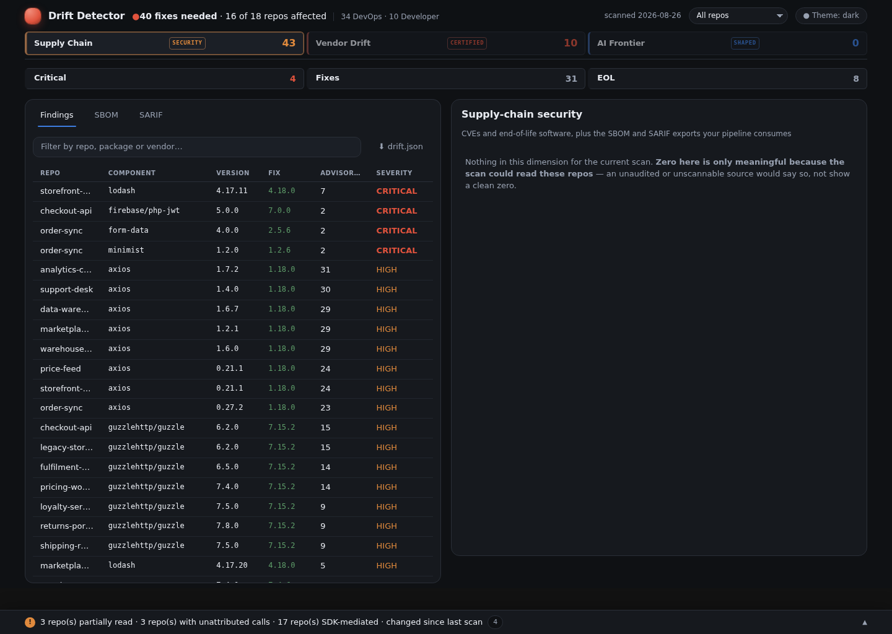
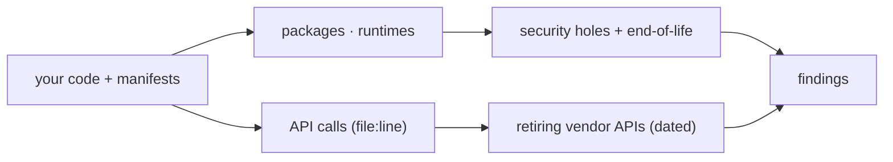
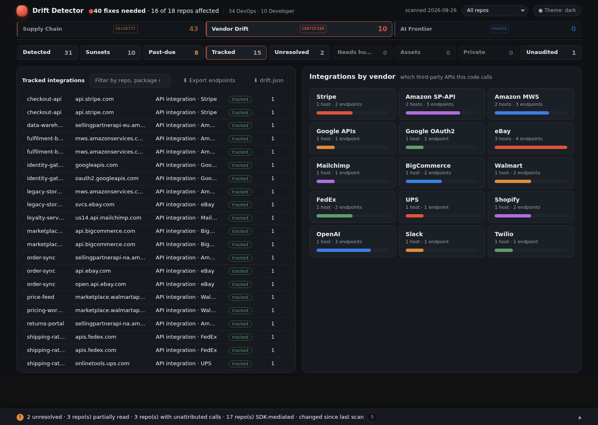
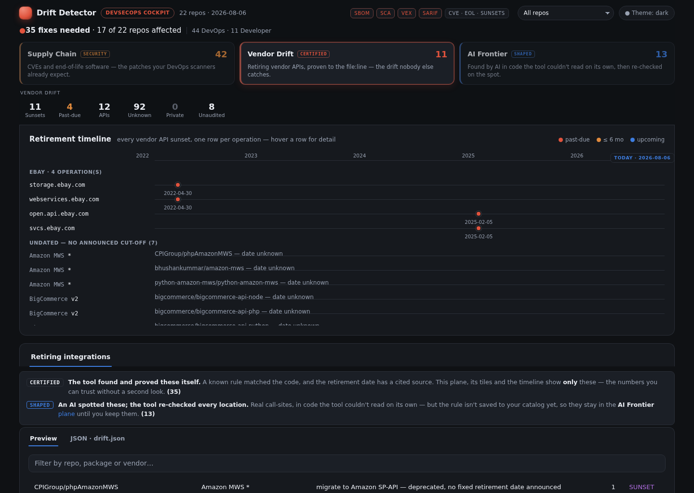

```
▗▄▄  ▗▄▄▖  ▄▄▄ ▗▄▄▄▖▗▄▄▄▖     ▗▄▄  ▗▄▄▄▖▗▄▄▄▖▗▄▄▄▖  ▄▄ ▗▄▄▄▖ ▗▄▖ ▗▄▄▖ 
▐▛▀█ ▐▛▀▜▌ ▀█▀ ▐▛▀▀▘▝▀█▀▘     ▐▛▀█ ▐▛▀▀▘▝▀█▀▘▐▛▀▀▘ █▀▀▌▝▀█▀▘ █▀█ ▐▛▀▜▌
▐▌ ▐▌▐▌ ▐▌  █  ▐▌     █       ▐▌ ▐▌▐▌     █  ▐▌   ▐▛     █  ▐▌ ▐▌▐▌ ▐▌
▐▌ ▐▌▐███   █  ▐███   █       ▐▌ ▐▌▐███   █  ▐███ ▐▌     █  ▐▌ ▐▌▐███ 
▐▌ ▐▌▐▌▝█▖  █  ▐▌     █       ▐▌ ▐▌▐▌     █  ▐▌   ▐▙     █  ▐▌ ▐▌▐▌▝█▖
▐▙▄█ ▐▌ ▐▌ ▄█▄ ▐▌     █       ▐▙▄█ ▐▙▄▄▖  █  ▐▙▄▄▖ █▄▄▌  █   █▄█ ▐▌ ▐▌
▝▀▀  ▝▘ ▝▀ ▀▀▀ ▝▘     ▀       ▝▀▀  ▝▀▀▀▘  ▀  ▝▀▀▀▘  ▀▀   ▀   ▝▀▘ ▝▘ ▝▀
```

> **Know before it breaks.**

**AI proposes. The scanner adjudicates.**

Claude finds third-party integrations the rules can't see yet. Drift Detector
**proves** them — `file:line`, sourced retirement dates — or says **needs-human**.
The certified scan path is deterministic (**zero AI tokens**); it never invents a
date, and AI leads never mix into certified findings.

It catches three kinds of rot on the **certified** path:

1. **Retired vendor APIs** — a service you call (eBay, Amazon, Shopify, …) is **shutting down** an
   API your code still uses. *Example: "eBay's `GetCategoryFeatures` — called at
   `EbayCategoryFieldsFeature.php:72` — is retired as of 2026‑06‑04; migrate to the Taxonomy API."*
   **No SBOM or CVE scanner sees this** — it's the reason the tool exists.
2. **End-of-life software** — a runtime or framework version the maker no longer supports/patches.
3. **Known security holes** — public vulnerabilities in the packages you depend on.

It runs as a **[Claude Code](https://docs.anthropic.com/en/docs/claude-code) plugin**. Point Claude at
your code; `/drift-detector` runs the certified scan and, by default, a token-costing AI
cross-check kept in a **separate trust tier**. Where the tool *can't* see, it says so — never a
false all-clear.

### The jargon, once (plain terms)

| Term | In plain English |
|---|---|
| **vendor-API sunset** | A third-party service is retiring an API your code calls. |
| **EOL** (end-of-life) | A software version the maker stopped supporting/patching. |
| **CVE** | A publicly-catalogued security hole in a software package. |
| **OSV** | The public database of those security holes (`osv.dev`) the tool checks against. |
| **SBOM** | A "bill of materials" — the list of every component your code depends on (standard CycloneDX/SPDX files, for compliance). |
| **SARIF** | A standard file format for code-scan results (GitHub code-scanning and VS Code read it). |
| **the Cockpit** | The interactive dashboard the tool publishes each run. |

- **What it's made of:** the deterministic core is Python (stdlib + PyYAML) + the **ast-grep**
  engine — **zero AI tokens**; the AI plane adds *leads*, kept strictly separate.
- **Trustworthy by construction:** same inputs → identical output; every certified report is
  machine-verified before it's shown, and an AI lead can never enter it.

> Where it's headed: **[docs/ROADMAP.md](docs/ROADMAP.md)**.

---

## Use it

Install the plugin, point it at a folder, and Claude runs the scan — keeping
**certified truth** separate from **AI leads**:

```
/plugin marketplace add TOPSinfo/drift-detector-scan
/plugin install drift-detector@tops-tools
/drift-detector /path/to/a/folder          # one repo, or a folder of repos
```

One command runs the certified planes (CVE/EOL + vendor-API sunsets) alongside an AI
cross-check — which runs by default and costs tokens — then opens the **Cockpit**. The AI
tier may never propose a retirement date; it reports `yes`/`no`/`unknown` and stays quarantined
from the certified findings. Anything Claude learns about a new integration shape
persists to `~/.drift/catalog` only after the absorb gate — and makes later runs smarter.

*(First run provisions its own venv and fetches the pinned ast-grep engine — needs
[`uv`](https://docs.astral.sh/uv/) or Python 3.11+ with venv, nothing else to install.)*

> **Headless / CI footnote:** same slash command works unattended via
> `claude -p "/drift-detector <repo…>" --permission-mode bypassPermissions`
> (exit `0` ok · `2` error · `3` found problems · `4` couldn't scan/verify). Supported today;
> fleet-scale CI is not the homepage story.

---

## Architecture

The certified pipeline is **offline and deterministic** — same inputs produce byte-identical output,
and it spends **zero AI tokens.** Only the "audit" step reaches the network (to public databases).



The **AI plane** (plugin only) runs alongside the certified core — shaping repos the scan can't read
on its own — and its results reach the Cockpit as the separate **AI Frontier** plane, gate-validated
and never mixed into the certified numbers.

**① scan** — the [ast-grep](https://ast-grep.github.io) engine (a pinned static binary) finds the
third-party API calls in your source down to `file:line`, and manifest/lockfile parsing finds your
packages, runtimes, and frameworks. Output: `inventory.json` (the map of what you use).

**② audit** — each thing found is checked against three sources, and classified **act-now** or
**review**, always with a cited link:
- **OSV.dev** → known security holes (CVEs) per package version;
- **endoflife.date** → end-of-life runtimes/frameworks;
- **the vendor-sunset catalog** (`agent/vendor_sunsets.yaml`) → a **curated, dated, sourced** list
  of retiring vendor APIs, matched against the API calls found in step ①. *This is the layer no
  other scanner has.*

<p align="center">
  
  <br><em>The <b>DevOps view</b> — package security holes (OSV CVEs) and end-of-life findings, one row per package, each with the exact upgrade.</em>
</p>

**③ one report** — everything becomes `drift.json`, the **single source of truth.** The
human-readable `drift.md`, the Cockpit dashboard, the SBOM, and any filed issues are all
**projections** of it.

### Why you can trust it — `verify`

`drift-scan verify` **re-derives every projection from `drift.json` and fails if any disagrees.**
A green `verify` is the *only* claim the tool makes that a report is correct — nobody eyeballs the
dashboard for accuracy. It checks the dashboard's embedded data matches the report exactly, that
every dashboard tile's number equals the rows it filters to, and that nothing dated is silently
dropped. Two guarantees underpin everything:

- **"Cannot see" is never "clean."** If it can't read a repo (no access, unknown language), it says
  so and exits non-zero — never a false green checkmark.
- **Never invent a date.** Every retirement carries a source link fetched that run; undated ones
  say "no date announced." Nothing enters the catalog without passing a review gate.

### Detection — what it can see

Packages and security holes are table stakes. The **differentiator is the vendor-API layer**: it
knows *which third-party APIs your code calls* and *when the vendor kills them.*



It keeps up with new integration shapes through a **reviewed adaptation mechanism**: a shape it's
taught (as catalog data, never code) it detects deterministically forever after. It never adapts on
its own — every new shape passes the `absorb` review gate first (sourced dates, no false endpoints,
residue must shrink), so the tool learns without ever admitting an unverified finding.

<p align="center">
  
  <br><em><b>Which third-party APIs your code calls</b>, by vendor — the layer no SBOM or CVE scanner has. <b>Fictional fleet; real vendors and real dates.</b></em>
</p>

### The Cockpit

The **Cockpit** is the interactive dashboard, organized as **three planes** — in decreasing order of
certainty, each with its own tiles and content:

- **Supply Chain** — CVEs and end-of-life software, plus the **SBOM** and **SARIF** exports (which
  live only here). The table-stakes supply-chain hygiene any SCA tool does.
- **Vendor Drift** *(certified)* — the retiring-vendor-API layer: a per-operation **retirement
  timeline** and the migration queue, proven to `file:line`. *The layer no other scanner has.*
- **AI Frontier** *(shaped)* — call-sites an AI recovered from code the deterministic scan couldn't
  read on its own, each re-checked and **gate-validated**, kept strictly out of the certified numbers.

Tiles and totals count **certified** findings only; the AI Frontier is always its own plane (and
shows an honest empty-state when no shaping ran). Findings roll up into **ranked jobs** — thirty
security holes in one package become **one** upgrade job, not thirty tickets — each carrying an
emoji-coded title (🚨 past-due · ⏳ upcoming · ☣️ end-of-life · 🛡️ security), a 📊 link to the
Cockpit, and a 🤖 **Open in Claude** link that pre-loads the finding for whoever picks it up.

<p align="center">
  
  <br><em>The <b>three-plane cockpit</b> — <b>Supply Chain</b> (CVE/EOL + SBOM/SARIF), <b>Vendor Drift</b> (the certified <b>Retirement Timeline</b>, past-due left of today), and the <b>AI Frontier</b> (shaped, gate-validated) — zero here because no AI pass was run on the demo fleet, not because the plane is empty by design.</em>
</p>

---

## Outputs

Every run writes to a state directory; open `dashboard.html` in a browser, or read `drift.md` in the
terminal.

| File | What it is |
|---|---|
| `inventory.json` | The map of everything your repos use (packages, runtimes, API calls at `file:line`). |
| `audit.json` | The findings + ranked jobs + what changed since last run. |
| **`drift.json`** | **The one report** everything else is derived from (and `verify`-checked against). |
| `dashboard.html` | The **Cockpit** — the interactive dashboard. |
| `drift.md` | The plain-text version of the report. |
| `summary.html` | The quick view — the coverage tree on its own page. |
| `chart.html` | The timeline of what changed across runs. |

Two more are **exports, written on demand** rather than by `run` — `drift-scan sbom --state <dir>`
and `drift-scan sarif --state <dir>`:

| File | What it is |
|---|---|
| `sbom.json` | Standard SBOM (CycloneDX/SPDX) for compliance tooling. |
| `drift.sarif.json` | SARIF, for GitHub code scanning and VS Code. Note `verify` does **not** re-parse it: it is an export, not a verified projection. |

## What's built today

| Capability | Status |
|---|---|
| Deterministic scan → inventory of packages, runtimes & API calls (`file:line`) | ✅ |
| Security-hole (OSV) + end-of-life (endoflife.date) checks | ✅ |
| **Retiring-vendor-API detection** + the curated, dated, sourced catalog | ✅ |
| AI cross-check plane (leads for shapes the rules miss) + the `absorb` intake gate | ✅ |
| `drift.json` + `verify` (the trust contract) | ✅ |
| SBOM (CycloneDX/SPDX) + SARIF exports | ✅ |
| The Cockpit dashboard (tiles, retirement timeline, deep-links) | ✅ |
| Headless / scheduled runs via `claude -p` (per-repo issues, idempotent, "Open in Claude") | ✅ |

Where it's headed next: **[docs/ROADMAP.md](docs/ROADMAP.md)**.

---

## Repo map

```
.claude-plugin/      plugin manifest + marketplace entry
commands/            the plugin commands — drift-detector · drift-research · drift-absorb · …
bin/drift-scan       self-provisioning engine the plugin calls (fetches the pinned scanner + a venv)
agent/               the pipeline: scan · audit · run · deliver · absorb (catalog intake)
agent/lib/           the pieces — engine, endpoint detection, OSV/EOL, ranking, delivery, verify, dashboard, config
agent/*.yaml         the reviewed catalogs — vendors · vendor_sunsets · idioms ·
                     catalog_attestations · host_reputation · sdk_clients ·
                     sdk_profiles · frameworks
agent/assets/        the Cockpit — dashboard template + app + vendored runtime
templates/ci/        CI templates copied into a CUSTOMER's repo by onboarding (not run here)
deploy/drift-ops/    template for the private state/config repo a fleet needs
eval/                the SCANNER corpus — public repos pinned at a SHA + the recall gate
evals/               the PROMPT corpus — promptfile discipline probes (different thing, easily confused)
docs/                the documentation site (mkdocs.yml) · schema/ (the drift.json contract)
tests/               the suite; each test comment pins a real shipped bug
```

`eval/` and `evals/` are genuinely different: the first measures whether the *scanner* finds
what it should, the second whether the *promptfiles* keep their load-bearing rules.

Working conventions for contributors: **[CLAUDE.md](CLAUDE.md)**.

## Limits (honest scope)

- API **version** is read from the URL on the matched line; it's `None` when a repo builds the URL
  from a base constant elsewhere (would need dataflow — out of scope).
- Only **directly-declared** dependencies are audited (not transitive ones pulled in by lockfiles).
- Security/EOL sources are OSV + endoflife.date; the vendor-sunset catalog is **curated** — you
  extend it (each entry cites a source).
- The dashboard shows the **latest** run; week-over-week history is a future layer (see the roadmap).

---

*Every finding is dated and sourced; every report is `verify`-certified; where it's blind, it says so.*
**Know before it breaks.**
