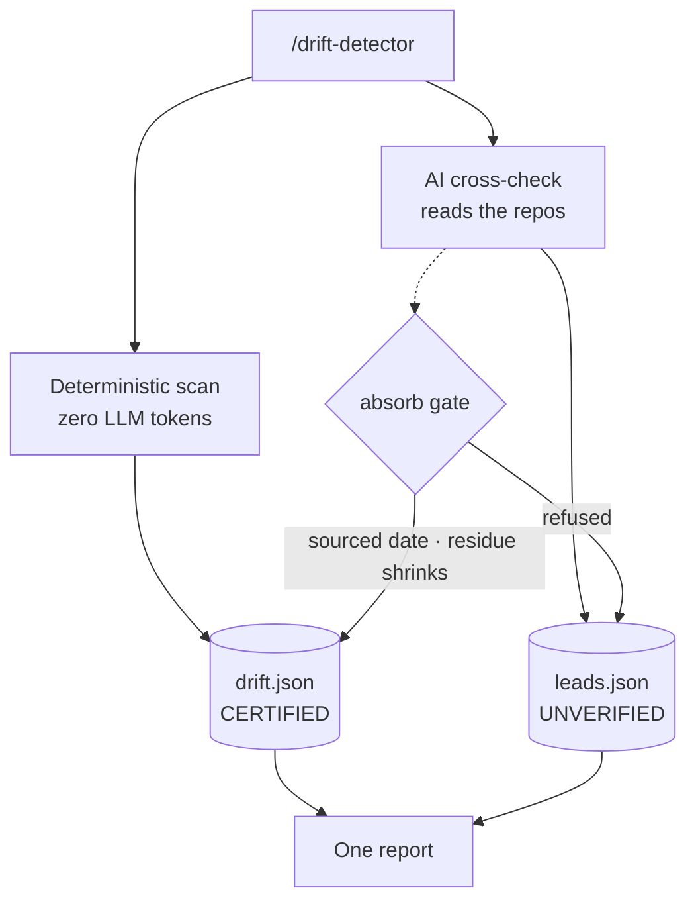
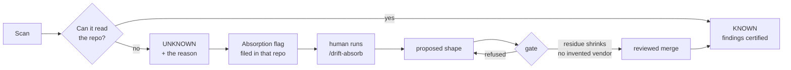

# FAQ

Ordered from "I have never seen this before" downwards. Nothing here is a trick question —
if you are wondering it, it belongs here.

## What is Drift Detector, in one sentence? { .faq }

It finds the third-party APIs your code calls that are **being switched off**, and tells you the
exact file and line that calls them.

## What problem does it solve that my existing scanner doesn't? { .faq }

Most scanners check your **packages** for known vulnerabilities. That is a solved, commoditised
problem — the data comes free from public databases.

Nobody checks your **vendor APIs**. When Amazon retires `/fba/inbound/v0`, or eBay switches off
`webservices.ebay.com`, no CVE is filed. There is no feed. Your code simply starts failing on a
date somebody announced in a changelog two years ago.

That second thing is what this is for. It does the package check too, but that isn't the point.

## Do I need Claude Code to use it? { .faq }

Yes. It ships as a Claude Code plugin, and that is the only supported way to install it. There is
no standalone CLI package to `pip install`.

## Does it cost anything to run? { .faq }

The scan that produces certified findings costs **zero tokens** — it is ordinary local parsing.

Alongside it, an AI pass reads your repos looking for integrations the rules have not learned
yet. That pass **runs by default and does cost tokens**. Its output is kept separate as
unverified leads and cannot become a certified finding without a human.

## Does my source code leave my machine? { .faq }

The deterministic scan reads your code **locally**. Nothing is uploaded by it.

The audit step then asks two public services about what it found:

- **OSV** receives only `{ecosystem, name, version}` — for example `("npm", "axios", "0.21.1")`
- **endoflife.date** receives only a product slug, like `php`

Neither receives source code, file paths or repository names.

The **AI cross-check is different**: it reads your repositories and sends that content to Claude.
If that is unacceptable in your environment, run the deterministic path only — that is exactly
what the scheduled CI job does, and it needs no API key at all.

## Will it change anything in my repository? { .faq }

No. It reads. It writes its report to a state directory you nominate.

The only thing that ever writes elsewhere is the optional delivery step, which files issues in
your tracker — and only if you configure it to.

## Which languages can it read? { .faq }

Eight: **PHP, Python, Ruby, Go, Java, JavaScript, TypeScript and C#**. One scan covers a mixed
codebase, and vendor detection works across all of them from a single catalog entry.

## Do I have to configure anything before the first run? { .faq }

No. Point it at a folder and it goes:

```
/drift-detector /path/to/a/folder
```

The first run provisions its own environment and fetches the pinned parsing engine.
Configuration only appears when you want a *fleet* — many repos on a schedule.

## What is the difference between a "CVE" and a "sunset" here? { .faq }

A **CVE** is a known security hole in a package you depend on. Fix by upgrading.

A **sunset** is a vendor switching off an API you call. No upgrade helps — you must change the
call. Sunsets are the harder problem, because nothing warns you.

## It found nothing. Am I safe? { .faq }

**Not necessarily, and the report will tell you which.** This is the distinction the whole tool
is built around:

- "0 findings" for a vendor that has been **audited** means something
- "0 findings" for a vendor marked `UNAUDITED` or `queued` means **nobody has checked yet**
- "0 findings" for a vendor marked `BLOCKED` means somebody tried and **was refused** — the
  vendor publishes retirements only behind a partner login

A clean-looking result with unaudited vendors is not a clean bill of health, and the report says
so in those words rather than showing you a green tick.

## What does UNKNOWN mean next to one of my repos? { .faq }

It means the scanner could not fully read that repo — usually because the API host is assembled
at runtime rather than written as a literal string, so there is nothing to match.

`UNKNOWN` is a deliberate answer, not a failure. The alternative — reporting it as healthy —
would be a lie. The report gives the reason, the lines it could not resolve, and how to teach it.

## Where do the retirement dates come from? Can I trust them? { .faq }

Every date carries the **vendor's own source URL** and the day it was checked. Not a blog, not a
summary — the vendor's page.

This is enforced rather than encouraged: a gate refuses to accept any date that does not appear
in a document fetched from that source. The project has been burned by plausible-but-wrong
dates, which is exactly why the gate exists.

## How do the deterministic and AI parts differ, and where do they meet? { .faq }

They never merge. They are shown side by side and separated by construction.



| | certified | AI leads |
|---|---|---|
| LLM tokens | **zero** | yes |
| may state a date | yes, with a source | **never** — only `yes`/`no`/`unknown` |
| reaches `drift.json` | yes | **never**, except through the gate |

The last row is proven, not promised: a `verify` invariant fails if a lead ever appears in the
certified data.

## What happens when it cannot read one of my repos? { .faq }

It says so, and it asks for help.



The flag carries the reason, the blind lines, and the exact command to fix it — and **closes
itself** once the repo comes back `KNOWN`. A human merge is always required: the gate can only
say "this would pass", never "this is now true".

## A new third-party URL appeared in my code. Would I know? { .faq }

Yes, on the run it first appears:

- an unrecognised host is marked `queued` — detected, not yet catalogued, and explicitly **not**
  counted as clean
- `needs-human` separates *we looked and could not tell* from *nobody looked*
- it shows up in that run's `endpointsAdded` delta

## Can I add a vendor it doesn't know? { .faq }

Yes — that is the normal way the tool grows. Detection goes in `agent/vendors.yaml`, retirements
in `agent/vendor_sunsets.yaml` (each with its source), and an attestation records the day you
checked. New entries only enter through the gate, never by editing around it.

## Where are the rules kept? { .faq }

Split in two on purpose.

**Data** — reviewed YAML under `agent/`, which is what actually changes week to week:

| file | holds | today |
|---|---|---|
| `vendors.yaml` | host → vendor detection | 79 vendors |
| `vendor_sunsets.yaml` | dated, sourced retirements | 97 entries · 19 vendors |
| `catalog_attestations.yaml` | when each vendor was last checked | 60 vendors |
| `idioms.yaml` | [idioms](glossary.md#idiom) — code shapes it has been taught, for calls whose host is built at runtime | 11 instances |
| `sdk_clients.yaml` | dependency → vendor | 30 rows |

**Code** — `agent/lib/vendor_rules.py` compiles those into the parser's rule pack. Nothing is
hand-written per repository.


## How do I know the report's numbers are right? { .faq }

Run `drift-scan verify`. It re-parses every surface — the Markdown, the dashboard, the JSON —
and fails if any of them disagree.

A green `verify` is the **only** claim the project makes that a report is correct. "It looks
right" is not one.

## Can I run it on a schedule, and have it file issues? { .faq }

Yes. Templates for GitHub Actions and GitLab CI ship with it, and onboarding wires them up. The
scheduled path is the deterministic one — zero tokens, no API key.

Delivery is idempotent: a re-scan **updates** the existing issue rather than filing a duplicate,
and an issue closes itself when its finding is resolved.

## Can I see how things changed since last week? { .faq }

Partly — and this is a known gap rather than a claim.

Every run records what is new versus resolved, and what endpoints, SDKs and runtimes changed;
every run's state is committed, so the trail exists in git history. What does **not** exist yet
is a rendered trend view: the dashboard shows the latest run only. Week-over-week burn-down is
the first item on the [roadmap](ROADMAP.md).

---

**Building or maintaining the tool rather than running it?** The guards, invariants and
doctrine live in [How it stays honest](how-it-stays-honest.md) — the verify contract, the
absorb gate, the attestation model, and where it is deliberately blind.
