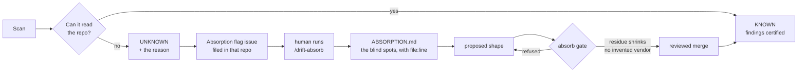

# FAQ

Questions from real demos, answered with the files that back them. Counts here are current as
of the catalog in `master`.

## Where are the rules?

Two layers, deliberately separated.

**Data — reviewed YAML under `agent/`.** This is what changes weekly:

| file | holds | size today |
|---|---|---|
| `agent/vendors.yaml` | host → vendor detection | 79 vendors |
| `agent/vendor_sunsets.yaml` | dated, **sourced** retirements | 49 entries · 15 vendors |
| `agent/catalog_attestations.yaml` | when each vendor's schedule was last checked | 52 vendors |
| `agent/idioms.yaml` | repo *shapes* the scanner can be taught | 11 instances |
| `agent/sdk_clients.yaml` | dependency → vendor (when the SDK *is* the evidence) | 29 rows |

**Code — `agent/lib/vendor_rules.py`.** It compiles those catalogs into an ast-grep rule pack:
one broad URL-literal rule, per-vendor domain rules, per-language egress sinks, and the shape
rules from the idiom families. Nothing is hand-written per repo.

The split is the point: a rule is *data a human reviewed*, not code someone deployed.

## Where is the code that makes this hard to copy?

Three things, in order of how hard they'd be to reproduce:

**1. The sunset catalog and its attestation model.** Anyone can list CVEs — OSV gives them away.
Nobody publishes "vendor X switches off operation Y on date Z". `agent/vendor_sunsets.yaml` is
curated, every entry citing the vendor's own page. `agent/lib/catalog_coverage.py` carries the
idea that matters: **an entry count is not coverage.** A vendor with entries but no attestation
is `UNAUDITED`, and its zero findings prove nothing.

**2. Attribution down to `file:line`, across 8 languages.** `agent/lib/endpoints.py`,
`classify_url.py`, `idioms.py`. Finding the *host* is easy; proving *which line* calls a retired
operation, in a repo whose host is injected at runtime, is not.

**3. The gates.** `agent/absorb.py` refuses a date without a fetched source; `agent/resolve.py`
gates AI verdicts. They're why the catalog can be grown quickly without becoming untrustworthy.

## How do the deterministic and AI runs differ — and where do they meet?

They never merge. They are rendered side by side and separated by construction.

```mermaid
flowchart TD
    R[/drift-detector] --> D[Deterministic scan<br/>zero LLM tokens]
    R --> A[AI cross-check<br/>reads the repos]
    D --> J[(drift.json<br/>CERTIFIED)]
    A --> L[(leads.json<br/>UNVERIFIED)]
    A -.-> G{absorb gate}
    G -->|sourced date · residue shrinks| J
    G -->|refused| L
    J --> C[One Cockpit]
    L --> C
    V[drift-scan verify] --> J
    V -. ai-firewall invariant .-> L
```

| | certified | gate-validated | AI leads |
|---|---|---|---|
| produced by | `agent/run.py` | `agent/lib/adhoc.py` | `agent/lib/probabilistic.py` |
| LLM tokens | **zero** | shape authored by AI | yes |
| may state a date | yes, with a source | only from the human catalog | **never** — `yes`/`no`/`unknown` |
| reaches `drift.json` | yes | only through `absorb` | **never** |

The last row is enforced, not promised: `verify`'s `ai-firewall` invariant fails if a lead ever
appears in the certified data.

## Where is the corpus?

`eval/corpus.yaml` — 38 real public repositories pinned at exact SHAs, each with the vendor it
must detect. `eval/taxonomy.md` enumerates the failure modes a miss is allowed to be.
`docs/EVAL.md` explains the recall gate.

The clones themselves are **never committed** — they're fetched into a sandbox at eval time.
That's why you won't find them in the tree. Run it with `drift-eval run <category>`.

## Was the PyPI package removed?

Yes. `pyproject.toml`, the publish workflow and the container channel are all gone; the tool
ships **only** as a Claude Code plugin. A regression test asserts the `uvx --from` install path
can never come back — it once caused a version skew where the packaged engine disagreed with the
orchestration and failed its own `verify`.

## When the scanner can't read a repo, what happens?

It says so, and it asks for help. It never reports the repo as clean.



The flag issue carries the verdict, the reason, the blind-spot `file:line`s and the exact
bootstrap command. It **closes itself** once the repo comes back `KNOWN`. A human merge is
mandatory — the gate can only ever say "this would pass", never "this is now true".

## A new third-party URL appeared. How would I know?

The run it first appears, it is marked — not silently absorbed:

- unclassified hosts get `coverage: queued` (detected, not yet catalogued — **not** "clean")
- `needs-human` distinguishes *we looked and couldn't tell* from *nobody looked*
- it lands in the run's `endpointsAdded` delta
- `drift-scan research` prints the queued work-list

"Queued" is a promise the report keeps: it is never counted as healthy.

## Can I see how things changed since last week?

Partly, and this is a known gap rather than a claim. Each run records `delta` (new vs resolved
findings, by fingerprint, with `first_seen`) and `inventoryDrift` (endpoints, SDKs and runtimes
added, removed or changed), and every run's state is committed — so the trail exists in git
history.

What does not exist yet is a **rendered** trend: the dashboard shows the latest run only.
Week-over-week burn-down is the first item on the [roadmap](ROADMAP.md).

## What is each top-level directory for?

| path | what lives there |
|---|---|
| `agent/` | the runtime — CLI, pipeline, and the reviewed catalogs |
| `agent/lib/` | the pieces: scanning, classification, idioms, delivery, rendering |
| `bin/drift-scan` | the self-provisioning engine the plugin calls |
| `commands/` | the plugin promptfiles — what Claude actually executes |
| `templates/ci/` | CI templates copied into a **customer's** repo by onboarding |
| `deploy/drift-ops/` | the template for the private state/config repo a fleet needs |
| `eval/` | the **scanner** corpus — pinned repos + recall gate |
| `evals/` | the **prompt** corpus — promptfile discipline probes |
| `docs/` | this site, plus the `drift.json` schema |
| `tests/` | 1349 tests; each comment pins a real shipped bug |
