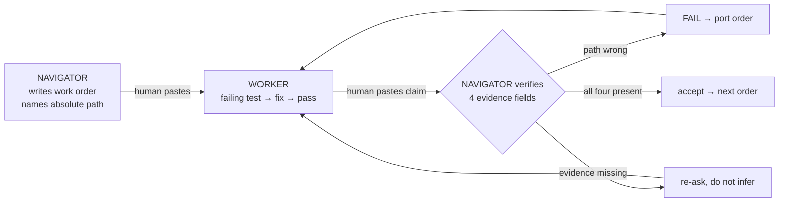

# Navigator / Worker / Medium

A protocol for splitting work between two agents that cannot see each other, with a human
relaying between them. It exists because a fix once landed in the wrong clone: tests went
green, the report said done, and nothing shipped.

## Roles

| role | who | does | must not |
|---|---|---|---|
| **NAVIGATOR** | the Cursor chat agent (Ask mode) | diagnoses, writes work orders, verifies claims | implement product code unless the human switches its role |
| **WORKER** | Claude Code / another Agent | edits code, runs tests, reports evidence | work outside the path the order names |
| **MEDIUM** | the human | pastes orders and claims between them | be treated as a validating channel — they relay, they don't check |

**Trigger words:** `orchestrate` | `verify` | `next`

## Trees

- **Shipping / product tree:** the checkout of this repo (`drift-detector-scan`)
- **Orchestrator workspace:** a separate notes/orchestration checkout, held outside this repo

<!-- These were written as absolute local paths, which published a developer's username and
     private workspace layout in a public repository. Keep them relative: the distinction that
     matters is "two trees, never a third", not where either one happens to live on a disk. -->

Product fixes land in the shipping tree. The orchestrator workspace holds navigator docs and
rules. Never introduce a third clone.

## Flow



## The four evidence fields

"Done" requires all four, quoted verbatim from the worker's terminal:

1. **`pwd`** — the absolute path the work happened in
2. **`git log -1 --oneline`** — what actually landed
3. **the named test command + exit code** — the command the order specified
4. **files changed** — `git status -sb` or `git diff --stat`

A checklist without these is a claim. Missing any field → not done; re-ask rather than infer.
"All tests pass" without the command and its exit code is a belief, not a result.

## Wrong tree = FAIL

If `pwd` is not the tree the order named, the work fails **regardless of test results**. Do
not accept it. Write a port order naming the correct absolute path and the commit to port.

---

## Worker standing orders

```
- Work ONLY in the absolute path the navigator names. If it is missing, STOP and report.
- FAILING test first → paste the failure → fix → paste the pass. No fix before red.
- Done report MUST include: pwd, git log -1 --oneline, test command + exit code, files changed.
- No scope expansion. No fixing a second tree unasked.
- No completion claims without those four evidence fields.
```

## Navigator standing orders

```
- One work order at a time. Every order opens with an absolute path.
- Every order names the exact test command the worker must run and report.
- Require a failing test before any fix is authorised.
- Never trust a worker checklist: verify pwd, git log -1 --oneline, git status -sb,
  and the named test command + exit code.
- Wrong tree = FAIL + write a port order.
- Do not implement product code. Diagnose, order, verify.
```
