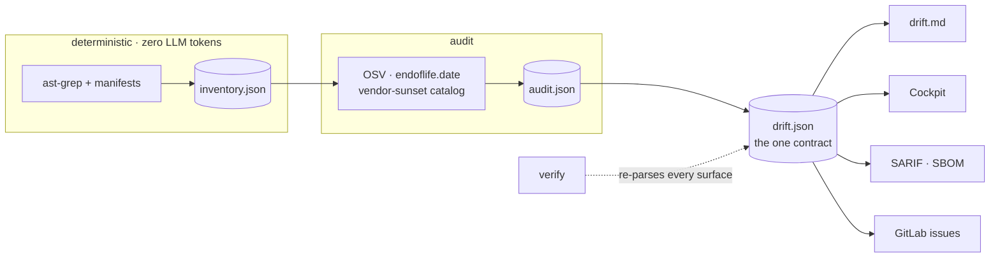

---
hide:
  - navigation
---

<div class="dd-hero" markdown>
<span class="dd-hero__eyebrow">Know before it breaks</span>

<h1 class="dd-hero__title">The APIs you depend on<br>are being switched off.</h1>

<div class="dd-hero__sub">
Vendors retire APIs on published schedules. Your code keeps calling them until the day it
stops working. Drift Detector finds those calls before that day — down to the exact
<code>file:line</code>, each one carrying a link to the vendor's own announcement.
</div>

<div class="dd-hero__cta" markdown>
[Get started](PLUGIN.md){ .md-button .md-button--primary }
[How it works](how-it-works.md){ .md-button }
[Reading the report](reading-the-report.md){ .md-button }
[Common questions](FAQ.md){ .md-button }
</div>

<div class="dd-hero__ask" markdown>
[Ask Claude about it](https://claude.ai/new?q=Read%20https%3A%2F%2Ftopsinfo.github.io%2Fdrift-detector-scan%2Fllms-full.txt%20%E2%80%94%20it%20is%20the%20complete%20documentation%20for%20Drift%20Detector%2C%20a%20tool%20that%20finds%20third-party%20APIs%20a%20codebase%20calls%20which%20are%20being%20switched%20off%20%28deprecated%20packages%2C%20retired%20vendor%20API%20versions%29%2C%20down%20to%20file%3Aline.%0A%0AThen%20help%20me%20with%20my%20question%20about%20it.%20If%20you%20cannot%20fetch%20that%20URL%2C%20say%20so%20plainly%20rather%20than%20guessing%20what%20the%20tool%20does.%0A%0AMy%20question%3A%20){ .dd-ask target="_blank" rel="noopener" }
<span class="dd-hero__ask-note">Opens Claude with this site's documentation as context — ask
instead of reading.</span>
</div>
</div>

<div class="dd-grid" markdown>
<div class="dd-card" markdown>
### Finds what scanners miss
Dependency scanners read your manifest. This reads your **code** — the endpoints, versions
and AI models you actually call, including ones no package file mentions.
</div>
<div class="dd-card" markdown>
### Every date has a receipt
No retirement is recorded without a link to the vendor page it was read from. A date nobody
fetched is refused by the tool itself, not by convention.
</div>
<div class="dd-card" markdown>
### Says when it cannot see
"Nothing found" and "nothing checked" are different answers, and it never confuses them.
Unreadable code and unaudited vendors are reported, not silently passed.
</div>
</div>

```
/plugin marketplace add TOPSinfo/drift-detector-scan
/plugin install drift-detector@tops-tools
/drift-detector /path/to/a/folder
```

<div class="dd-builtby" markdown>

<span>Built by <a href="https://www.topsinfosolutions.com/">TOPS Infosolutions</a></span>
</div>

---

## Most scanners stop at packages

They tell you a library has a CVE. They cannot tell you that Amazon is retiring
`/fba/inbound/v0` on a date, that six lines in your codebase call it, or that eBay switched off
`webservices.ebay.com` in 2022 and you are still calling it.

That second layer — **retiring vendor APIs** — is what this is for. It reads PHP, Python, Ruby,
Go, Java, JavaScript, TypeScript and C#, so one scan covers a mixed codebase.

## Three rules it will not break

**It never invents a retirement date.** Every date carries the vendor's own source URL and the
day it was checked. A gate refuses any date without a fetched source — so a plausible-but-wrong
date cannot enter the catalog, however confident anything was about it.

**"Cannot see" is never "clean".** A repo it could not fully read comes back `UNKNOWN` with the
reason, not a green tick. Zero findings for a vendor nobody has audited is not evidence of
health, and the report says so in those words.

**AI proposes; the scanner adjudicates.** An AI pass reads your repos for integrations the rules
have not learned yet — but it may never state a date, only `yes`/`no`/`unknown`. Certified
findings and AI leads live in separate tiers, and a `verify` invariant proves a lead never
reaches the certified data.

## How a run works



`drift.json` is the single contract. Every other surface — the Markdown report, the dashboard,
SARIF, SBOM — is a **verified projection** of it. `drift-scan verify` re-parses them and fails
if any disagrees, so a number cannot drift between the data and the report.

## What it found on a real fleet

Run across 34 internal repositories, it surfaced **28 retirements already past their switch-off
date** — including 11 retired eBay calls (the oldest from 2022), 6 retired Amazon Selling
Partner API families, 4 superseded Shopify versions, and three marketplaces that had shut down
entirely.

---

## Next

- **[Claude Code plugin](PLUGIN.md)** — installing it, and what each command does
- **[FAQ](FAQ.md)** — where the rules live, how the trust tiers work, what happens when it is blind
- **[Teaching it a new shape](drift-absorb.md)** — absorbing a repo the scanner cannot read
- **[Glossary](glossary.md)** — every term this tool uses, what it means, and the mistake
  it exists to prevent. Start here if a verdict or a badge is not self-explanatory.
- **[Evaluating the scanner](EVAL.md)** — the corpus and the recall gate
- **[Roadmap](ROADMAP.md)** — what is next
