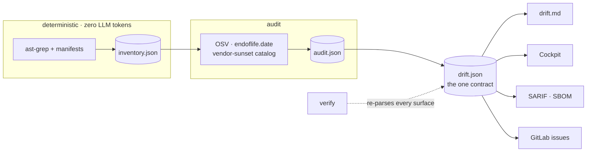

---
hide:
  - navigation
---

# Know before it breaks.

Drift Detector finds the third-party APIs your code calls that are **being switched off** —
down to the exact `file:line`, each with a link to the vendor's own announcement.

It runs as a [Claude Code](https://docs.anthropic.com/en/docs/claude-code) plugin:

```
/plugin marketplace add TOPSinfo/drift-detector-scan
/plugin install drift-detector@tops-tools
/drift-detector /path/to/a/folder
```

[Get started](PLUGIN.md){ .md-button .md-button--primary }
[Common questions](FAQ.md){ .md-button }

---

## Most scanners stop at packages

They tell you a library has a CVE. They cannot tell you that Amazon is retiring
`/fba/inbound/v0` on a date, that six lines in your codebase call it, or that eBay switched off
`webservices.ebay.com` in 2022 and you are still calling it.

That second layer — **retiring vendor APIs** — is what this is for. It reads PHP, Python, Ruby,
Go, Java, JavaScript, TypeScript and C#, so one scan covers a mixed codebase.

## Three rules it will not break

**It never invents a retirement date.** Every date carries the vendor's own source URL and the
day it was checked. A gate refuses any date without a fetched source — so a plausible-but-wrong
date cannot enter the catalog, however confident anything was about it.

**"Cannot see" is never "clean".** A repo it could not fully read comes back `UNKNOWN` with the
reason, not a green tick. Zero findings for a vendor nobody has audited is not evidence of
health, and the report says so in those words.

**AI proposes; the scanner adjudicates.** An AI pass reads your repos for integrations the rules
have not learned yet — but it may never state a date, only `yes`/`no`/`unknown`. Certified
findings and AI leads live in separate tiers, and a `verify` invariant proves a lead never
reaches the certified data.

## How a run works



`drift.json` is the single contract. Every other surface — the Markdown report, the dashboard,
SARIF, SBOM — is a **verified projection** of it. `drift-scan verify` re-parses them and fails
if any disagrees, so a number cannot drift between the data and the report.

## What it found on a real fleet

Run across 34 internal repositories, it surfaced **28 retirements already past their switch-off
date** — including 11 retired eBay calls (the oldest from 2022), 6 retired Amazon Selling
Partner API families, 4 superseded Shopify versions, and three marketplaces that had shut down
entirely.

---

## Next

- **[Claude Code plugin](PLUGIN.md)** — installing it, and what each command does
- **[FAQ](FAQ.md)** — where the rules live, how the trust tiers work, what happens when it is blind
- **[Teaching it a new shape](drift-absorb.md)** — absorbing a repo the scanner cannot read
- **[Evaluating the scanner](EVAL.md)** — the corpus and the recall gate
- **[Roadmap](ROADMAP.md)** — what is next
