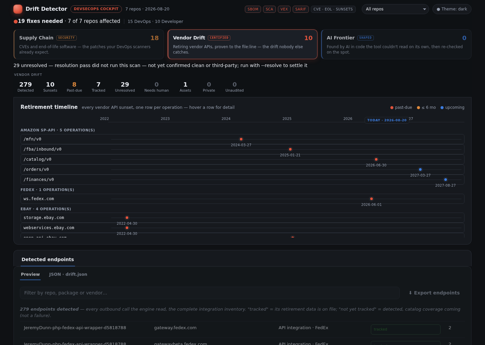
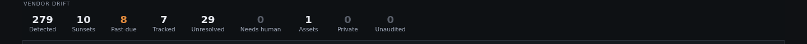
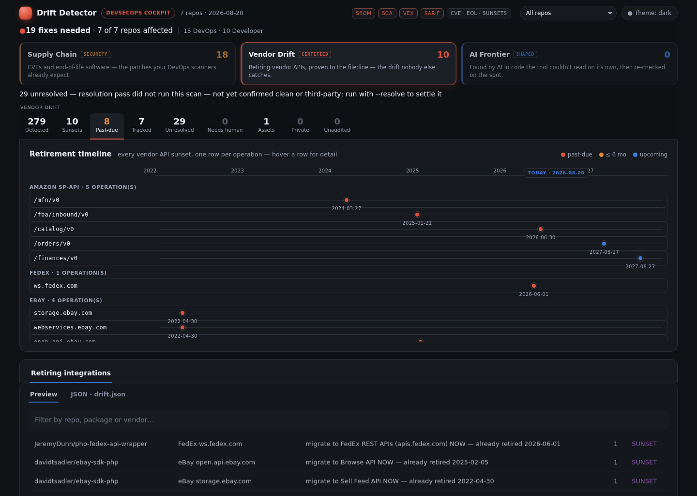
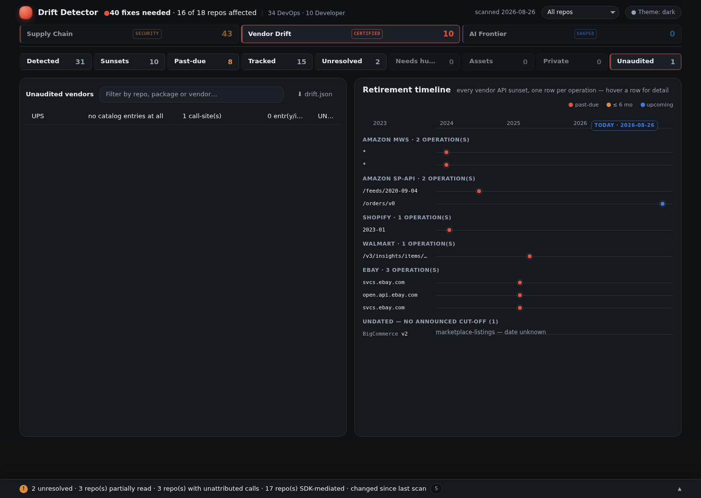

# Reading the report

Every number on this page is one you can click, and every one has a precise meaning. This
page explains all of them, in the order you meet them.



*Every screenshot on this page is a real scan of an **invented** eighteen-repo fleet —
`checkout-api`, `order-sync`, `legacy-storefront` and the rest are fictional, and so is the
company. Everything else is real: the vendors, the retirement dates and the CVEs all come from
the shipped catalog and from OSV, because a made-up vendor would not be detected at all. No
customer data, and nothing hand-edited — the numbers are whatever the scanner produced.*

There are two surfaces: the **Cockpit** (the interactive dashboard) and **drift.md** (the
flat report, best for pasting into a ticket). They are the same data — the Cockpit is a
view of `drift.json`, and the tool re-reads both to confirm they agree before publishing.

---

## The three panels at the top

The first row answers "what kind of problem is this?"

| Panel | Badge | What it counts |
|---|---|---|
| **Supply Chain** | `SECURITY` | Known security holes (CVEs), end-of-life runtimes, and leaked credentials — what your existing security scanners also look for |
| **Vendor Drift** | `CERTIFIED` | Third-party APIs being switched off — the thing this tool exists for, proven to `file:line` |
| **AI Frontier** | `SHAPED` | Leads found by AI in code the deterministic scanner could not read, then re-checked |

The badges are a trust level, not decoration. **CERTIFIED** means every number came through
the machine-checked path. **SHAPED** means an AI proposed it and a gate validated it — useful,
but held to a different standard and never mixed into the certified count.

---

## The tiles



Clicking any tile filters everything below it. They are counts of **different things**, which
is why they don't add up to each other.

### About your integrations

| Tile | Means |
|---|---|
| **Detected** | Every outbound endpoint found, before any judgement — the raw total |
| **Tracked** | Distinct vendors that are catalogued, so retirements are being monitored |
| **Unresolved** | Found something, can't yet say whose it is — neither confirmed third-party nor confirmed yours |
| **Needs human** | The tool has stopped and asked. It will not guess |
| **Assets** | Images, fonts, CDN files — not integrations, counted so you can see they were excluded deliberately |
| **Private** | Endpoints on your own infrastructure, not a third party |

### About what's wrong

| Tile | Means |
|---|---|
| **Sunsets** | Vendor APIs with an announced retirement that your code calls |
| **Past-due** | Of those, the ones whose date has **already passed** — start here |
| **Critical** | Security issues rated critical — includes any leaked credential found, ranked at the top severity |
| **Fixes** | Total items needing action |
| **EOL** | Runtimes or frameworks past end-of-life |
| **Secrets** | Hardcoded API keys, passwords, or tokens found in your git history — rotate with the vendor, then remove from source |

### The one people misread

| Tile | Means |
|---|---|
| **Unaudited** | Vendors your code calls that **nobody has checked for retirements** |

This is the most important number on the page, and the easiest to skim past.

**A high Unaudited count with zero Sunsets does not mean you are safe.** It means the tool
found vendors it has never checked, so it is declining to tell you anything about them. Zero
findings for an unaudited vendor is an absence of *looking*, not an absence of *problems*.

Most scanners show a green tick here. This one shows the green tick **and** the gap.

---

## The findings table

Selecting **Past-due** filters everything to retirements whose date has already passed:




| Column | What it tells you |
|---|---|
| **Repo** | Which repository |
| **API** | The vendor and the specific thing retiring — a version, an operation, or a model |
| **Status** | See below |
| **Retires** | The date the vendor switches it off |
| **Call-sites** | How many places in the code call it — your effort estimate |
| **First call-site** | `file:line` of one of them, so someone can open it immediately |

### Status values

| Status | Meaning | Urgency |
|---|---|---|
| **DEPRECATED** | The date has passed, or is imminent | Act now |
| **REVIEW** | Announced, date still in the future | Plan it |
| **CURRENT** | Nothing announced against this | None |

A retired API rarely fails loudly. Some vendors "fall forward" — Shopify silently serves an
older version instead of erroring — so a past-due row can be *already* changing behaviour
without anything appearing in your logs.

### About Call-sites

This is the count of distinct `file:line` locations, not the number of findings. One
retirement touching seven places shows **7**, because seven is what someone has to change.

The displayed list of locations is capped for readability, but the count is always the true
total. If it says 22 and lists 6, there are 22.

---

## Vendor coverage



Separately from findings, each vendor carries a verdict about **our knowledge of it**:

| Verdict | Meaning |
|---|---|
| **CURRENT** | Checked against the vendor's own announcements, recently |
| **STALE** | Checked, but longer than 90 days ago — treat as expiring |
| **UNAUDITED** | Never checked — nobody has looked up what this vendor is retiring |
| **BLOCKED** | Checked, and **refused**: this vendor publishes retirements only behind a partner or seller login |

Attestations expire on purpose. A vendor checked a year ago is not a vendor you know about
today, and nobody ever re-reads a green tick unless something makes them.

**UNAUDITED and BLOCKED are not the same problem, which is why they are not the same word.**
An unaudited vendor needs somebody's *time*. A blocked one needs somebody's *credentials* —
no amount of further research will reach a page that requires a seller account. A blocked row
tells you exactly what was tried and what would open it, so the request goes to the right
person instead of back onto a research list it can never leave.

BLOCKED never becomes CURRENT on its own, and its call-sites keep counting as unchecked
exposure. Naming why we are blind does not make us sighted.

You may also see `whole-api-retired`: the entire vendor is catalogued as shut down, so there
is nothing further to check. That's a resolved state, not an unchecked one.

Every term used here — and the rest of the tool's vocabulary — is defined in the
[Glossary](glossary.md).

---

## Repository verdicts

| Verdict | Meaning |
|---|---|
| **KNOWN** | Every meaningful language had detection coverage, and nothing is left unattributed |
| **UNKNOWN** | Something couldn't be read — a language with no rules, or calls whose destination couldn't be resolved |

UNKNOWN is not a failure; it's the tool refusing to imply completeness it doesn't have. The
reasons are listed, and each one is a specific, fixable gap.

---

## The coverage tree

```
72 detected
├─ 30 integrations
│  ├─ 27 tracked   (27 classified rows → 21 distinct vendors)
│  ├─ 3 unresolved
│  ├─ 0 needs human
│  └─ 0 blocked
└─ 42 assets
```

Read top-down: of everything found, how much is a real integration, how much of *that* is
being monitored, and what's left over. The leftovers are the honest part — they're what the
tool cannot yet account for, shown rather than dropped.

---

## What to do with it

1. **Past-due first.** These are already switched off or fall-forward.
2. **Then REVIEW rows by date.** The Retires column is your calendar.
3. **Then look at Unaudited.** If it's large, your zero-findings result is weaker than it
   looks, and the fix is catalogue research rather than code changes.
4. **Check the repo verdicts.** An UNKNOWN repo may be hiding integrations entirely.

---

## Why you can trust the numbers

Every report is re-read by the tool before publication: it re-parses the report and the
dashboard and confirms they match `drift.json` exactly — headline counts, table rows,
call-site totals. A report that fails that check is not published.

So "can I trust this number?" has a real answer: `drift-scan verify` either passes or names
the specific thing that disagrees. More on the guards in
[How it stays honest](how-it-stays-honest.md).
